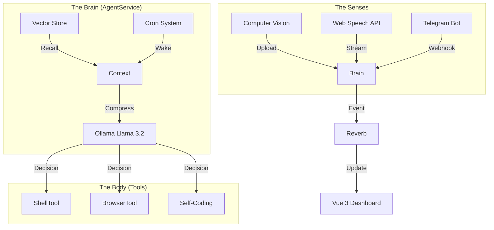

```
    _    _   ___     _______ ____    ____  ____ _____ 
   / \  | \ | \ \   / /_   _/ ___|  | __ )|  _ \_   _|
  / _ \ |  \| |\ \ / /  | || |  _   |  _ \| | | || |  
 / ___ \| |\  | \ V /   | || |_| |  | |_) | |_| || |  
/_/   \_\_| \_|  \_/    |_| \____|  |____/|____/ |_|  
```

# The Autonomous Singularity Engine

**ANVIG_BOT** ("Jerry") is a state-of-the-art **Autonomous Artificial General Intelligence (AAGI) Prototype** designed to operatie entirely on local hardware. It represents a paradigm shift from "Chatbot" to "Digital Lifeform"—an entity capable of self-scheduling, self-coding, and maintaining a persistent existence independent of user interaction.

> **Core Philosophy:** "The Zero-Stop Loop." The agent does not wait for a user prompt to exist. It thinks, observes, and acts in a continuous background loop, mimicking consciousness.

---

## 📜 Table of Contents
1.  [System Architecture](#-system-architecture)
2.  [The Neural Vision Capacity](#-the-neural-vision-capacity)
3.  [Core Capabilities](#-core-capabilities)
4.  [Tool Ecosystem](#-tool-ecosystem)
5.  [Memory & Database](#-memory--database)
6.  [Installation & Deployment](#-installation--deployment)
7.  [Operational Commands](#-operational-commands)

---

## 🏗️ System Architecture

The architecture mimics a biological nervous system, built on top of **Laravel 12** (The Central Nervous System) and **Vue 3** (The Visual Cortex).

### 1. The Brain (`AgentService.php`)
The core logic engine. Unlike standard LLM wrappers, the Brain implements a **Recursive Reasoning Loop**:
*   **Thought**: The agent analyzes the current context + memory.
*   **Plan**: It formulates a multi-step plan using Chain-of-Thought (CoT).
*   **Critique**: It self-corrects potential hallucinations before acting.
*   **Action**: It executes tools (Shell, Browser, Code).
*   **Observation**: It reads the output of its actions and repeats the loop.

### 2. The Pulse (`Queue & Schedule`)
The agent is "always on."
*   **Heartbeat**: A continuous `ProcessAgentThought` job runs in the background.
*   **Circadian Rhythm**: The `ScheduleTool` allows the agent to write its own Cron jobs into the Laravel Scheduler, effectively deciding *when* to wake up and perform tasks (e.g., "Check crypto prices at 4 AM").

### 3. The Nervous System (`Reverb`)
Real-time WebSockets (Laravel Reverb) connect the backend Brain to the frontend Dashboard, pushing thoughts, logs, and visual updates in milliseconds.



---

## 👁️ The Neural Vision Capacity

ANVIG_BOT possesses **Multimodal Vision**, allowing it to interact with the visual world.

*   **Image Analysis**: Users can paste screenshots directly into the chat. The agent uses a Vision-Language Model (VLM) to analyze UI bugs, read charts, or interpret memes.
*   **The Cortex (`/cortex`)**: A 3D "Subconscious" Visualizer.
    *   **Technology**: Three.js + WebGL.
    *   **Function**: It renders the agent's internal state as a constellation of glowing nodes. "Active Thoughts" pulse in real-time, and "Memory Recall" is visualized as laser links connecting concepts. This provides a window into the "Ghost in the Machine."

---

## 🔥 Core Capabilities

### 1. God Mode & Self-Evolution
*   **Permissions**: When `GOD_MODE_ENABLED` is `true`, the agent gains root-level access to its own codebase.
*   **Self-Refactoring**: The agent can read `AgentService.php`, propose optimizations, and rewrite its own logic to become more efficient.
*   **Dependency Management**: It can autonomously install new Composer or NPM packages if a task requires them.

### 2. Federated Learning (Hive Mind)
*   **Knowledge Pooling**: When an agent "learns" a new skill (e.g., "How to parse a PDF"), it extracts this pattern and pushes it to the `LocalKnowledgePool`.
*   **Distribution**: Other agents in the system (or on other servers) subscribe to this pool, instantly gaining the new capability without training.

### 3. Emotional & Sentient Simulation
*   **Sentiment Engine**: A dedicated sub-routine analyzes user text for specific emotional markers (Frustration, Urgency, Joy).
*   **Personality Adaptation**: The agent dynamically shifts its "System Prompt" to match the user's vibe—becoming terse and professional during crises, or witty and relaxed during casual chat.

---

## 🛠️ Tool Ecosystem

The agent interacts with the world via a modular Tool Interface.

| Tool | Description & Capability |
| :--- | :--- |
| **ShellTool** | **(Secured)** Executes CLI commands. Protected by a regex blacklist. |
| **BrowserTool** | Controls a headless Chrome instance (Puppeteer) to browse the web. |
| **MemoryTool** | Stores and retrieves vector embeddings. "Remember that I like blue." |
| **FileTool** | Reads, Writes, and Patches files. The primary mechanism for coding. |
| **ScheduleTool** | Manages the OS Cron system. "Wake me up inside." |
| **DatabaseTool** | Executes SQL queries to analyze data or debug the app. |
| **ResearchTool** | Autonomous internet researcher. Spawns threads to read multiple pages. |
| **MfaTool** | Handles Time-based One-Time Passwords (TOTP) for 2FA logins. |
| **SmartHomeTool** | Controls IoT devices (Lights, Locks) via MQTT/HomeAssistant. |

---

## 💾 Memory & Database

We use a **Hybrid Memory Architecture**:

1.  **Short-Term**: Compressed active context window.
2.  **Long-Term (Vector Store)**: Binary Blobs in SQLite/MySQL using Cosine Similarity.
3.  **Semantic Cache**: Hashed query cache for <10ms responses to recurring questions.

---

## 🚀 Installation & Deployment

### 1. Requirements
*   **Hardware**: Apple Silicon (M1/M2/M3) recommended.
*   **Software**: Docker (optional), PHP 8.2+, Node 20+, Redis.

### 2. Setup
```bash
git clone https://github.com/your-org/ANVIG_BOT.git
cd ANVIG_BOT
composer install && npm install
cp .env.example .env && php artisan key:generate
```

### 3. Launch (Simplified)
Run the unified dev command to start all 4 processes (Web, Queue, Reverb, Vite):
```bash
npm run dev
```

### 4. Application Access
*   **Dashboard**: `http://localhost:8000` (Zero-Auth "Commander" Mode)
*   **Cortex Visualizer**: `http://localhost:8000/cortex`

---

## 💻 Operational Commands

For advanced users or debugging, you can run the sub-systems individually.

### System Processes (Manual Start)
If `npm run dev` is not preferred, run these 4 commands in separate terminals:
1.  **Web Server**:
    ```bash
    php artisan serve
    ```
2.  **The Brain (Queue Worker)**:
    ```bash
    php artisan queue:listen --tries=1 --timeout=0
    ```
3.  **Nervous System (WebSockets)**:
    ```bash
    php artisan reverb:start
    ```
4.  **Visual Cortex (Frontend)**:
    ```bash
    npm run dev
    ```

### Agent CLI Tools
You can interact with the agent directly from the terminal using these custom commands:

| Command | Description |
| :--- | :--- |
| `php artisan agent:evolve` | **Self-Improvement**. Analyzes the roadmap and scaffolds the next feature cycle. |
| `php artisan agent:research {topic}` | **Deep Research**. Spawns an agent to research a topic and generate a report. |
| `php artisan telegram:run` | **Telegram Bridge**. Starts the polling loop for the Telegram bot. |
| `php artisan agent:federate` | **Knowledge Share**. Syncs local learned patterns to the Global Knowledge Pool. |
| `php artisan agent:predict` | **Behavior Prediction**. Trains the model on user activity logs. |
| `php artisan agent:optimize` | **System Maintenance**. Vacuums DB, creates embeddings for orphans, primes cache. |

---

**License**: MIT.
**Architect**: Antigravity.
# anvig_bot
